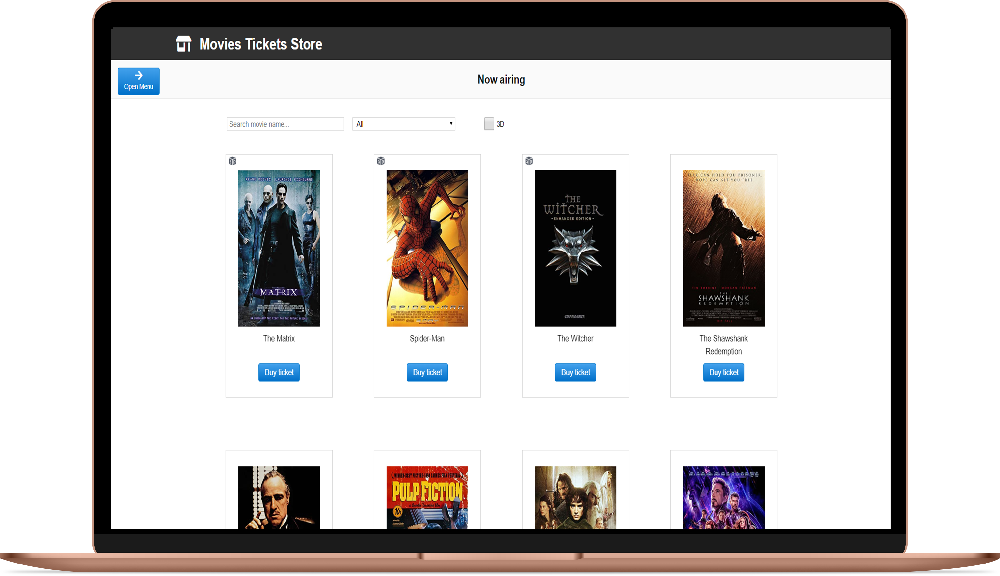
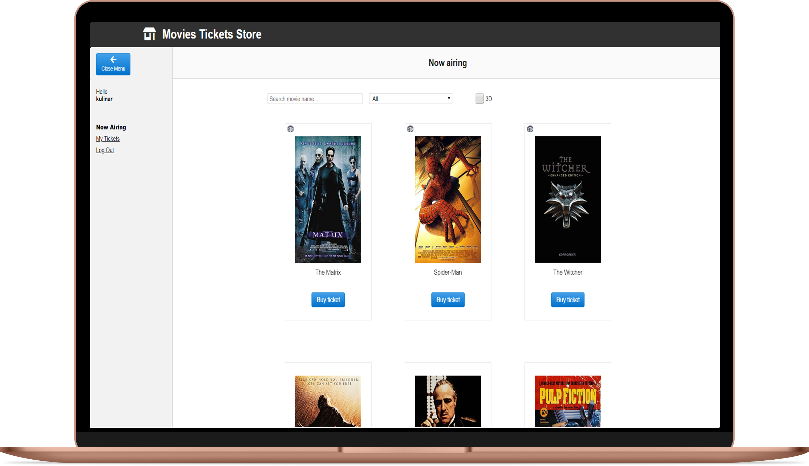
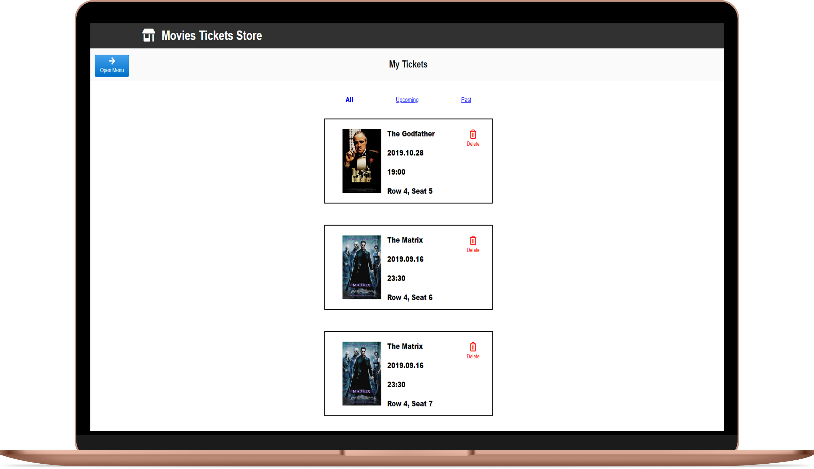
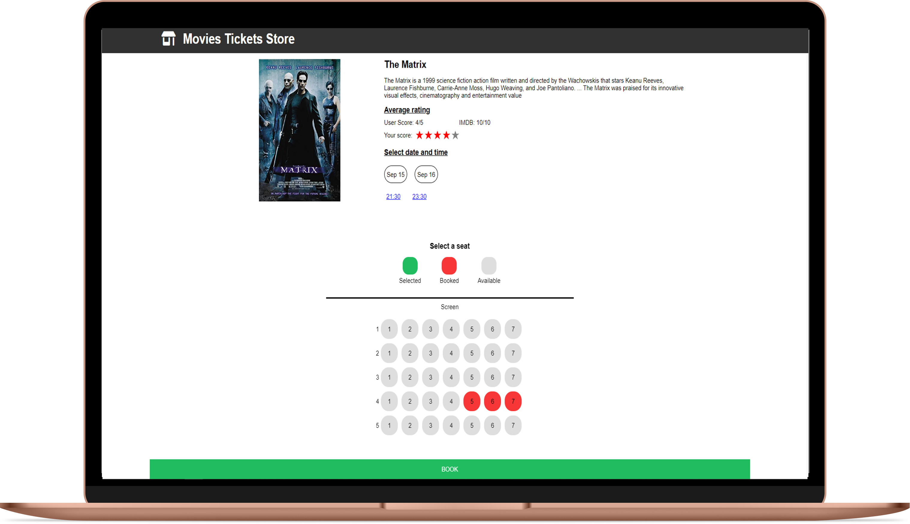
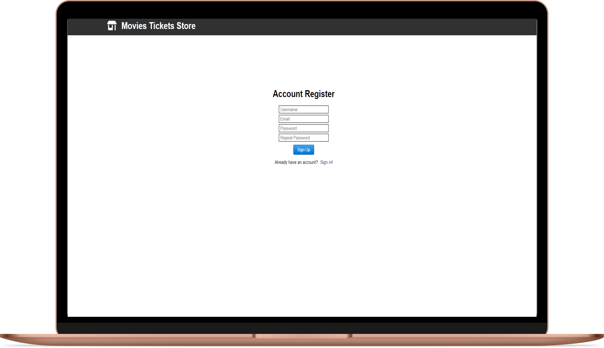
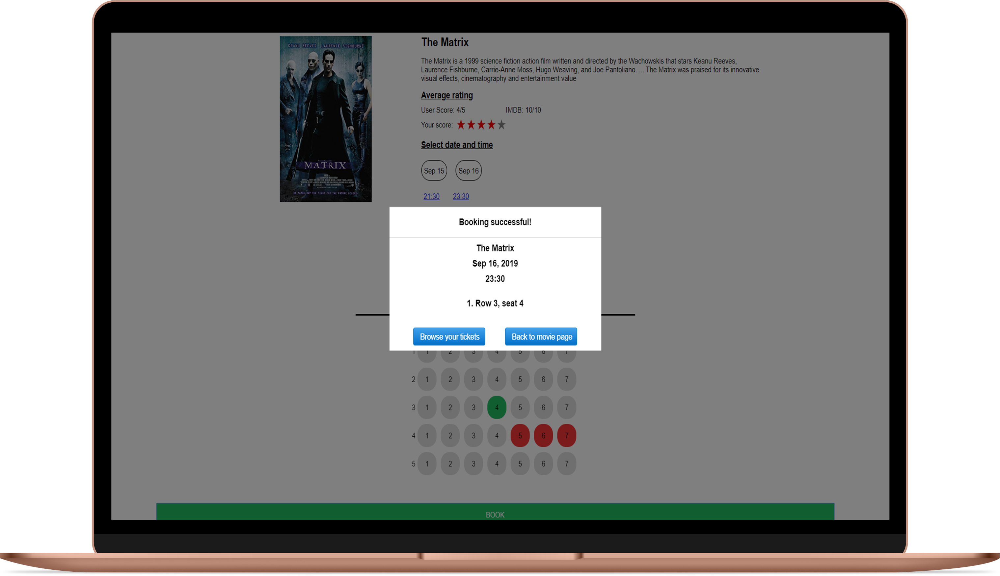

# React-movies-tickets-store

Full stack MERN app made in React.js that simulates reservation system in a cinema. With React hooks, Context & JWT authentication.(Desktop + Mobile)

## Technologies

-   React.js
-   JavaScript
-   CSS
-   HTML
-   Webpack
-   Node.js
-   Express.js
-   MongoDB/mongoose
-   JSON Web Token
-   bcrypt.js
-   SCSS
-   Flexbox
-   TypeScript

## Setup

```bash
git clone https://github.com/kulinar310/react-movies-tickets-store.git
cd react-movies-tickets-store
npm install
npm run dev2
In order see the functionality of the screeningroom, select movies Matrix or The Godfather
```

## Features

-   Authentication
-   Registration of new users
-   Infinite scroll of movie list
-   Movie rating
-   Display of details of selected movie
-   Display of screenings schedule for selected movie
-   Ticket reservation by selecting seats on a room layout

## Screenshots


&nbsp;
&nbsp;
&nbsp;

&nbsp;
&nbsp;
&nbsp;

&nbsp;
&nbsp;
&nbsp;

&nbsp;
&nbsp;
&nbsp;

&nbsp;
&nbsp;
&nbsp;

&nbsp;
&nbsp;
&nbsp;
